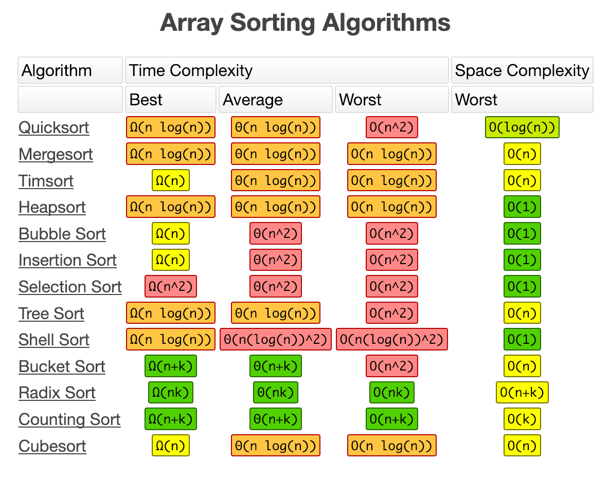

_Provided by [Big O Cheatsheet](http://bigocheatsheet.com/)_

<article id="1">

- The fastest you can go in any comparison sorting algo for worst case is `n log n`

## Quick Sort

- Divide and conquer / recursive
- there are a lot of variations of this algo that try to solve the pivot problem
  - we will go with the original simplest approach

> `bigO = n ^ 2`

### Pseudocode

- pick the pivot (last element in the array)
- divide array into to halves
  - left arr will be <= to pivot
  - right arr will be > pivot
- keep recursing over those instructions until you hit the base case where the length of arr is 1 or 0
  - once you hit that, concat the left list, the pivot, and then the right list

### Implementation

See the Pen <a href="https://codepen.io/RyanGarant/pen/jXLeYO/">Visualized Algo: Quicksort Exercise</a> by Ryan Garant (<a href="https://codepen.io/RyanGarant">@RyanGarant</a>) on <a href="https://codepen.io">CodePen</a>.

</article>

<article id="2">

## Bubble Sort

> `bigO = n ^ 2`

- **iterative**
- Called bubble sort because it looks like it is bubbling
- it's n^2 because your for loop is n iterations and your do while loop is n iterations (n \* n)
- You probably will never use a do loop or bubble sort in production code

### Pseudocode

- double loop over array input
- if index is greater than next index swap items in place & continue
- exit early if no swap occurred within the second loop

### Implementation

See the Pen <a href="https://codepen.io/RyanGarant/pen/roMaKZ/">Visualized Algo: Bubble Sort Exercise</a> by Ryan Garant (<a href="https://codepen.io/RyanGarant">@RyanGarant</a>) on <a href="https://codepen.io">CodePen</a>.

</article>

<article id="3">

## Insertion Sort

`bigO = n ^ 2`

- **iterative**
- called insertion because you are inserting in place
- Has **more favorable coefficients** than bubble sort
- Better for things that are **near sorted**
- merge sort and quick sort are pretty much faster in all other cases

### Pseudocode

- setup a double loop

- 2nd loop will run while it is less than the first loop's index
- if loop 1 index is less than 2nd loop's index then
  - pull loop 1 index out in place
  - insert loop 1 index before loop 2 index in place

### Implementation

See the Pen <a href="https://codepen.io/RyanGarant/pen/XojJEP/">Visualized Algo: Insertion Sort</a> by Ryan Garant (<a href="https://codepen.io/RyanGarant">@RyanGarant</a>) on <a href="https://codepen.io">CodePen</a>.

</article>

<article id="4">

## Merge Sort

`bigO = O(n log n)`

- **Recursive** algo that is very **stable**, consistent & dependable
  - However when sorting numbers stability doesn't matter because you don't care what order two 4's for instance are given to you
- Most often the sorting algo you will use

### Pseudocode

- stitch function
- mergeSort function
  - base case is if size of arr is one
  - return a recursively call passing in left & right half to stitch function

### Implementation

See the Pen <a href="https://codepen.io/RyanGarant/pen/ZVpYdq/">Visualized Algo: Merge Sort</a> by Ryan Garant (<a href="https://codepen.io/RyanGarant">@RyanGarant</a>) on <a href="https://codepen.io">CodePen</a>.

</article>
