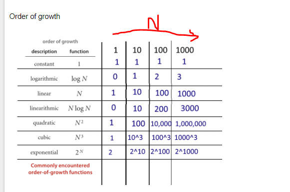

#{$page.description}

<article id="1">

## Big O Notation

[](https://postimg.org/image/x3n81brp5/)

[](https://postimg.org/image/hjfuashkp/)

- [Big O Cheatsheet](http://bigocheatsheet.com/)

> Big O sucks away the unimportant stuff so you can focus on what matters as it relates to algo performance with large inputs

- We are interested in orders of magnitude
  - So we only care if the difference is pretty large!



### O(1)

- When you have no loops and are just doing something and exiting/returning

### O(n)

- When you are doing the same amount of work that is going into a function

### O(n^2)

- Trick here is to look for double `for` or `while` loops

### O(log n)

- Where code employs **divide and conquer** strategies that use _recursion_ like merge and quick sorts
- Basically if you multiply input size by 10, the time will only increase by 1

</article>

<article id="2">

## Recursion

> Your **base case** is the most important piece. If you don't write this first you will stack overflow

### Recipe for recursion:

1.  Identify base case(s)
2.  Identify recursive case(s)
3.  return where appropriate
4.  write procecdures for each case that bring you closer to the base case(s)

```javascript
function basicRecursion(max, current) {
  if (current > max) return
  console.log(current)
  basicRecursion(max, current + 1)
}

basicRecursion(1, 10)
```

### Fibonacci Sequences

`1, 1, 2, 3, 5, 10`

- Fibonacci sequences lends itself well to recursion because they are themselves defined **recursively**
  - You need to know the **first two preceeding** terms to get the nth number of the sequence

```javascript
function fibonacci(n) {
  if (n <= 2) return 1

  return fibonacci(n - 1) + fibonacci(n - 2)
}
```

- Notice how we are returning the recursive function
  _ It is a common mistake to not return the recursive function
  _ What will happen is it will return `undefined` instead of preserving the value you are seeking

### Factorials

`!4 = 4 * 3 * 2 * 1`

- Factorials are defined recursively by **multiplying itself** by the previous number until you get to 1

```javascript
function factorial(n) {
  if (n < 2) return 1

  return n * factorial(n - 1)
}
```

</article>
