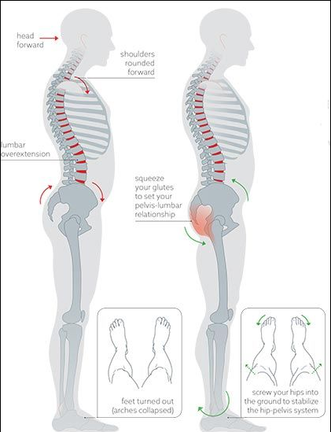
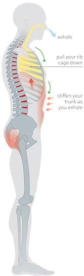
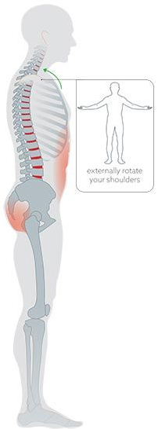
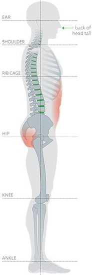

> These ideas are condensed from Dr. Starrett's book _Deskbound | Standing Up to a Sitting World_ [1]

<article id="standing-workstation">

## Standing Workstation

### Setting Up Your Standing Workstation

- Note: you do not have to spend a dime to get started with a standing workstation
  - You could go as simple as putting a couple cardboard boxes on your desk to raise your monitor & keyboard
  - Most of the ideas below have worked well for me or are recommendations by Dr. Starrett

#### Monitor

- top of screen aligned with eyes
- tilted slightly upward
- face 18 - 30 inches from monitor
- The monitor that you use is really that important as it relates to standing.
  - However, I went with a curved monitor which allows you to view your screen from many different angles
  - This allows you to move around while standing and still remained focused on the screen
  - I went with [two curved monitors](https://www.amazon.com/Sceptre-C278W-1920R-DisplayPort-immersive-Curvature/dp/B071JJ8V4S/ref=sr_1_3?s=electronics&ie=UTF8&qid=1549126673&sr=1-3&keywords=spectre+curved+monitor) which are about as economical as you can find in the curved monitor category (unless you need ultra high fidelity graphics & super high fps, this should suffice)

#### Keyboard & Mouse

- forearms parallel to floor
- keyboard & mouse directly under hands
  - As it relates to ergonomics, ideally your keyboard should have pitch/tint because it allows your arms to be in a more natural position
    - I type a lot so it was important for me to find a high quality ergonomic keyboard
      - I finally settled on the amazing [Model 01 Key from Keyboardio](https://shop.keyboard.io/)
      - It was a big learning curve but totally worth it and hopefully it will last more than a lifetime
      - [This one](https://www.amazon.com/Microsoft-Ergonomic-Keyboard-Business-5KV-00001/dp/B00CYX26BC/ref=sr_1_4_acs_osp_osp4-bc1ecdec_cov_2?s=electronics&ie=UTF8&qid=1549127247&sr=1-4-acs&keywords=keyboard+ergonomic&tag=windowscentralosp-20&ascsubtag=bc1ecdec-e399-4a86-90eb-18b5bd4ac8c4&linkCode=oas&cv_ct_id=amzn1.osp.bc1ecdec-e399-4a86-90eb-18b5bd4ac8c4&cv_ct_pg=search&cv_ct_wn=osp-search&pd_rd_wg=kDLma&pd_rd_w=VqZ3g&pf_rd_p=7f6b8bb9-631f-46f6-b8ad-496a9af123d5&pf_rd_r=6BH21495AEKY5PXQWH29&pd_rd_r=9b45acc5-53c2-4a7c-a2b2-3e216540655b&creativeASIN=B00CYX26BC&pd_rd_w=VqZ3g&pd_rd_wg=kDLma&pd_rd_r=9b45acc5-53c2-4a7c-a2b2-3e216540655b&pf_rd_p=7f6b8bb9-631f-46f6-b8ad-496a9af123d5&pd_rd_i=B00CYX26BC&pf_rd_r=6BH21495AEKY5PXQWH29) by Microsoft is a more cost effective option
- shoulders, elbows, & wrists in clean straight lines

#### Floor

- The main idea here is to elevate one of your legs by placing one foot on a surface

  - takes pressure off spine
  - leg no higher than 90 degrees
  - I usually just put my foot on random things around the house or office that are about a foot high

- Here are a couple other ideas that will encourage movement & increase your standing duration:
- [Balance Board](https://www.amazon.com/FluidStance-Plane-Premium-Standing-Balance/dp/B06VSYP3SY?ref_=bl_dp_s_web_16074995011)
  - I use the wooden version of this when it first came out and it's held up pretty nicely
- [anti-fatigue mat](https://www.amazon.com/gp/product/B000EFK9KM/ref=oh_aui_search_asin_title?ie=UTF8&psc=1) if working on hard surface
  - Beware of rolling chairs on these mats _mine tore up_ :(
- [fidget bar](https://www.roguefitness.com/rogue-fidget-bar)
  - I haven't tried this but it looks cool and Dr. Starrett developed it!
- [slant board](https://www.amazon.com/dp/B077GBLFL3/ref=sspa_dk_hqp_detail_aax_0?psc=1)
- box to put foot on
- **Shoes**
  - barefoot is the recommended option
  - 2nd best is shoes with flat sole
    - less cushion for softer surfaces
    - more cushion for harder surfaces

#### Stool

- used for leaning against, not sitting
- hard seat with squared edge and wide base so it doesn't fall when you lean against it

#### Desk

- There are tons of options in this category these days
- I opted for the middle ground and have been very happy with the [VARIDESK](https://www.amazon.com/gp/product/B00JI6NCCK/ref=oh_aui_search_asin_title?ie=UTF8&psc=1)

### Creating a Movement-Rich environment

</article>

<article id="bracing-sequence">

## Bracing Sequence

- Created by Dr. Starrett
- Everytime you catch your self out of position while standing throughout the day, use the bracing sequence
  - It is a short simple system that will give you consistent & healthy results
  - This is a chore at first but becomes instinctual

### Step by Step

**Step 1: Set pelvis in neutral position**

- position your feet parallel directly under hips
- slightly squeeze glutes
- subtly screw hips into ground by turning left leg counterclockwise & right leg clockwise

**Step 2: Brace position by balancing rib cage over pelvis**

- maintain previous position
- stiffen trunk & orient rib cage over pelvis while breathing out
- almost as if you are bracing for a punch in the gut

**Step 3: Organize shoulders**

- screw shoulders backward while arms at side until palms face forward
- drive arms back & up until they are perpendicular with the floor and palms facing upward
- don't let ribs flare or tilt

**Step 4: Set head in neutral position**

- balance head over shoulders
- fix gaze straight ahead
- align ears over center of shoulders, hips & ankles
- complete sequence by letting forearms & hands relax at sides with thumbs pointed forward and shoulders in casually wound-up, stable shape

</article>

[1]: https://www.amazon.com/Deskbound-Standing-Up-Sitting-World/dp/1628600586/ref=asc_df_1628600586/?tag=hyprod-20&linkCode=df0&hvadid=312069250960&hvpos=1o1&hvnetw=g&hvrand=4441383345837498340&hvpone=&hvptwo=&hvqmt=&hvdev=c&hvdvcmdl=&hvlocint=&hvlocphy=9031210&hvtargid=pla-436921375577&psc=1&tag=&ref=&adgrpid=61316180599&hvpone=&hvptwo=&hvadid=312069250960&hvpos=1o1&hvnetw=g&hvrand=4441383345837498340&hvqmt=&hvdev=c&hvdvcmdl=&hvlocint=&hvlocphy=9031210&hvtargid=pla-436921375577h
