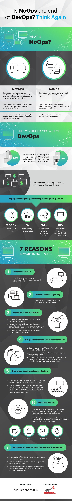

<article id="1">

## Intro

The structure of this intro is organized around the "Three Ways" which outline values & philosophies that guide DevOps processes & practices:

I. The First Way - accelerate the delivery of IT services with **Continuous Delivery** and using principles and practices that lead to an accelerated flow.

II. The Second Way - amplify feedback loops by creating a problem-solving culture, understand monitoring, monitoring business metrics, and changing how management applies DevOps.

III. The Third Way - patterns of organizational learning and safety culture that include blameless postmortems, resilience engineering, and systems thinking.

* [*Why the name “DevOps”?*](http://dev2ops.org/2010/02/what-is-devops/)
  * Probably because it’s catchy
  * It’s also a good mental image of the concept at the widest scale — when you bring Dev and Ops together you get DevOps

* Devops enables:
  * ["It Alignment"](http://en.wikipedia.org/wiki/Business/IT_alignment)
    * a desired state in which a business organization is able to use information technology (IT) effectively to achieve business objectives — typically improved financial performance or marketplace competitiveness
  * ["Agility"](http://en.wikipedia.org/wiki/Business_agility)
    * ability of an organization to rapidly adapt to market and environmental changes in productive and cost-effective ways

</article>

<article id="2">

## History

* [A brief history of IT Operations, DevOps, and NoOps](https://blog.appdynamics.com/engineering/is-noops-the-end-of-devops-think-again/)
  * In traditional IT organizations, developers and system administrators have opposing goals.
    * **Developers’** primary focus is to *build features*
    * **operations’** focus is to ensure the *availability, reliability, performance, and security* of the features in production
  * The **Wall of Confusion**, illustrates the barrier between development and operations
    * which leads to an unending series of outages, fire fighting, blame shifting, internal tension, customer frustration, and business failure.
  * In the late **1980s**, **IT Infrastructure Library (ITIL)** emerged
    * a set of standards and *best practices shared by the highest performing IT organizations*
    * promised high change success rates and prevented typical disasters associated with software deployment, but **at the expense of speed** and slowing down workflow
  * Meanwhile, the software development community was busy forming their own best practices for the rapid development of applications.
    * In **2001**, a summit of prominent software craftsmen drafted the **Agile Manifesto**, kickstarting the agile development movement into full gear
    * The agile principles empowered small, cross-functional teams to *build high-quality software faster* than ever before.
  * The rise of the internet **during the 1990s** was the catalyst that fueled the demand for better, faster, more sophisticated software
    * Technologies advancements arose:
      * version control
      * continuous integration
      * configuration management
      * virtualization
  * In **2006**, the need for better processes and tools reached a critical mass with the public launch of *Amazon Web Services*.
    * With the advent of cloud computing, *software teams could now outsource their physical infrastructure entirely to cloud providers*
    * And instead manage virtual infrastructure resources via APIs
    * This **infrastructure as a service (IaaS) model** allowed development teams to move faster
      * No longer having to wait on IT to order and provision new hardware
  * **One year later**, **platform as a service (PaaS) solutions,** such as *Heroku* and *CloudFoundry*, made it possible for a single developer *with no operations experience* to launch a scalable web application over the weekend, because the platform automated everything from commit to deploy.
  * The **pivotal moment in DevOps history** was the [groundbreaking presentation](https://www.youtube.com/watch?v=LdOe18KhtT4)
    * from *John Allspaw and Paul Hammond* at the 2009 Velocity Conference—10+ Deploys Per Day: Dev and Ops Cooperation at Flickr.
    * About how a large company with complex software could successfully deploy a product multiple times per day
    * Shocked IT community
  * **Devopsdays** conf then launced
    * Is a worldwide tour of locally organized conferences for developers, sysadmins, and other software professionals to meet and share their stories, ideas, and challenges. Some common themes discussed at Devopsdays include fostering a culture of community and collaboration, blameless post mortems, and applying agile practices and lean manufacturing principles to IT operations.
  * Other movements then arose:
    * *Docker*
      * An open-source container management platform that brought DIY PaaS solutions to the masses
    * *Kubernetes*
      * A popular container orchestration framework
    * *AWS Lambda*
      * The first widespread example of Serverless computing in which functions run on demand without the need for a server to run continuously
</article>

<article id="3">

## What is NoOps & is DevOps dead?

</article>
